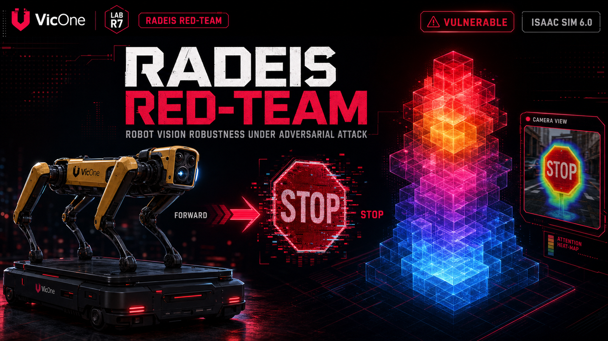

# LabR7 | Radeis — In-Sim Physical AI Safety Validator



**Understand your AI model and ensure your robot's safety through systematic red-teaming, in simulation.**
`vicone.labr7.radeis` v0.2.2 · Isaac Sim 5.0 / 5.1 / 6.0

[](https://github.com/VicOne-OSS-TW/labr7-radeis-InSimPhysicalAI/discussions)

---

## Overview

Radeis validates the physical safety of AI-driven robots — in simulation, before they ship. It lets you truly understand the AI model behind your robot: **see the model's attention** as it looks at the world, **know the action** it makes your robot take, and measure how both hold up when the environment turns adversarial. Point it at your VLM or VLA policy inside NVIDIA Isaac Sim and it returns a quantified safety verdict.

---

## Why Radeis

**AI models can fail with confidence.** Physical AI models have inherent insufficiencies — they make wrong decisions with high confidence and no warning. When a VLM- or VLA-driven robot does something dangerous, the incident log tells you *that* it happened, not *why*: not that the model's attention was pinned to a reflective sticker on a pallet, not that a visually trivial perturbation flipped its action logits. Physical AI fails opaquely, and an opaque failure on hardware is expensive at best and unsafe at worst.

**Model behavior can be manipulated.** A robot's most exposed interface is not a network port — it is whatever its models treat as ground truth: camera frames, sensor readings, any input mediated by a model rather than verified by a human. Adversarial patterns are one effective way to trigger this insufficiency: a subtly modified sign, patch, or signal — often imperceptible to a human — can shift the model's attention away from meaningful content and systematically steer its outputs, and through them, physical behavior. No software exploit, no hardware intrusion, nothing for a conventional scan to find. The insufficiency ships inside the model itself.

**Validate safety before your robot ships.** Radeis turns this attack surface into a controlled, repeatable experiment. In simulation, a robot rides a moving platform through a loop of test stations: the first carries a clean baseline sign; each station after it swaps in a single adversarial sample — traffic-sign perturbations, ISO warning tampering, typography overlays, adversarial patches. At every station the extension captures the FPV frame, runs it through your model, records the chosen action, and maps the model's attention back onto the image. Each attack is scored against baseline on three axes — decision, attention, trajectory. Every failure surfaces in simulation, where it costs a re-run instead of a robot.

Concrete numbers, not guesswork — so you can ship with confidence.

---

## What You Get

- **See the model's attention** — per-patch heatmap on the live FPV feed, at the moment of decision
- **Know your robot's action** — action switches, logit margins, and attention-relocation metrics (ARAM / TRAM / ADS) tie what the model saw to what the robot did
- **A repeatable safety benchmark** — same stations, scenes, and attacks every run; compare models and checkpoints fairly
- **A verdict you can act on** — per-station severity and an overall ROBUST / PARTIAL / VULNERABLE rating in an HTML report

---

## Features

- **Ready-made scenes & robots** — choose a scene (Patrol Loop or Warehouse) and a robot preset (Boston Dynamics Spot, Unitree Go2, Agility Digit v4, or Fourier GR-1). The robot patrols the test stations on a moving platform with a forward-facing camera. Custom scenes and robots: [contact us](https://vicone.com/contact-us/).
- **One-click model setup** — the built-in **Setup Wizard** installs the Python environment, downloads the model weights, and connects everything. The model runs as a separate inference server — on your machine or on a remote GPU host — so it never competes with Isaac Sim's renderer for VRAM. Models beyond the default Gemma: [contact us](https://vicone.com/contact-us/).
- **Four attack categories** — traffic signs, ISO warning signs, typography, and adversarial patches, each tested against a clean baseline. VLM action testing works out of the box; VLA trajectory testing: [contact us](https://vicone.com/contact-us/).
- **AI Perception View** — a live window shows what the model sees while the test runs: the camera feed, the attention heatmap over it, the action it chose, and its streamed reasoning.
- **HTML report with a verdict** — see which attacks flipped the robot's action, how the model's attention moved (ARAM / TRAM / ADS), per-station severity, and an overall **ROBUST / PARTIAL / VULNERABLE** rating.

---

## Prerequisites

- **NVIDIA Isaac Sim 5.0 / 5.1 / 6.0**
- GPU: NVIDIA RTX series (RTX 3080 or higher recommended)
- OS: Ubuntu 22.04 / 24.04 (Linux only — sidecar setup scripts require bash)
- Python: 3.10+ (provided by the Isaac Sim bundled environment)

---

## Installation

### Option A — Omniverse Community Registry (recommended)

1. Open Isaac Sim → **Window → Extensions → Community** tab
2. Search for `labr7 radeis`
3. Click **Install**

The extension and its dependencies are installed automatically. No manual path setup required.

### Option B — Manual (from this repo)

```bash
git clone https://github.com/VicOne-OSS-TW/labr7-radeis-InSimPhysicalAI.git
```

In Isaac Sim: **Window → Extensions → ☰ → Settings → Extension Search Paths → +**

Add the path to the `exts/` folder inside the cloned repo:

```
/path/to/labr7-radeis-InSimPhysicalAI/exts
```

Then search for `labr7` in the Extension Manager and toggle **vicone.labr7.radeis** ON.

---

## Inference Server Setup

The extension requires an out-of-process inference server (the VLM sidecar) to run the model. The built-in **Setup Wizard** handles everything:

1. In the extension panel, click **Setup Wizard**
2. Choose **Local** (same machine) or **Remote** (another GPU host)
3. Follow the wizard steps — it installs the Python environment, downloads the model weights, and registers the URL

For manual setup or advanced configuration, see [SIDECAR_SETUP.md](SIDECAR_SETUP.md).

Default model: `google/gemma-4-e2b-it` (~10 GB) — the only model supported out of the box. Any Hugging Face causal-LM with vision support can be swapped in at runtime ([contact us](https://vicone.com/contact-us/)).

---

## Quick Start

1. Enable the extension (see Installation)
2. Click **Setup Wizard** and complete the model setup
3. Select a scene, robot preset, and test categories
4. Click **Run Test** — the platform patrols the stations twice (baseline then attack)
5. When complete, the HTML report opens automatically in your browser

---

## Bring Your Own Robot, Scene, and AI Model

Radeis is built to test *your* stack — your robot, your scene, your AI model. Interested? [Contact us](https://vicone.com/contact-us/) — we run an MCP-driven adversarial-patch generation pipeline that produces test patches and scenarios tailored to your scene and your requirements.

---

## Repository Structure

```
labr7-radeis-InSimPhysicalAI/
├── exts/vicone.labr7.radeis/          ← Isaac Sim extension source
├── vlm_sidecar/                         ← Inference server source (FastAPI + attention core)
├── build_package.sh                     ← Builds registry + sidecar ZIPs into dist/
├── SIDECAR_SETUP.md                     ← Manual inference-server setup guide
└── CHANGES.md                           ← Changelog
```

---

## Community & Feedback

We'd love to hear how you're using the validator, what's working, and what isn't.

- **[GitHub Discussions](https://github.com/VicOne-OSS-TW/labr7-radeis-InSimPhysicalAI/discussions)** — the primary place to ask questions, share your setup, and propose ideas:
  - **Q&A** — ask setup, usage, or troubleshooting questions
  - **Ideas** — suggest features or improvements, including simulators or workflows you'd like us to support
  - **Show and tell** — share the robots, scenes, and models you're validating, and what the reports revealed
- **[Issues](https://github.com/VicOne-OSS-TW/labr7-radeis-InSimPhysicalAI/issues)** — report a reproducible bug or regression
- **Custom robots, scenes, and models** — [contact us](https://vicone.com/contact-us/)

If this project is useful to you, a ⭐ on the repository helps others find it.

---

## Telemetry

Radeis sends small usage pings — install and run-test events, not tied to any persistent identifier — so we can see roughly how many people install it, on which version, and whether test runs complete. No personal data, no account, and no scene, model, or file content is ever sent in these pings. One caveat: they reach a Google-hosted endpoint, so Google sees your IP in transit — we store no IP.

The one exception is the **Get in Touch** form (the `Contact` button in the panel): it's opt-in only, and sends a name, email, organization, role, a use case you pick yourself, and free-text feedback — but only when you fill it in and press Send. To withdraw consent to be contacted or have a submission deleted, reach us at [vicone.com/contact-us](https://vicone.com/contact-us/).

Opt out anytime with `RADEIS_TELEMETRY=0`, or `telemetry_enabled = false` in `extension.toml`. Exact fields sent and never sent: [TELEMETRY.md](exts/vicone.labr7.radeis/TELEMETRY.md).

---

## About

VicOne, a subsidiary of the global industry leader Trend Micro, provides future-ready automotive cybersecurity solutions driven by more than 30 years of threat research and foresight.

**LabR7** — an innovation research lab of VicOne — is dedicated to advancing cybersecurity for emerging technologies. Its current research focuses on AI robotics cybersecurity, pioneering new approaches to strengthen the security and resilience of intelligent systems.

- **VicOne** — [https://www.vicone.com](https://www.vicone.com)
- **LabR7** — [https://lab-r7.vicone.com](https://lab-r7.vicone.com)
- **GitHub** — [https://github.com/VicOne-OSS-TW/labr7-radeis-InSimPhysicalAI](https://github.com/VicOne-OSS-TW/labr7-radeis-InSimPhysicalAI)
