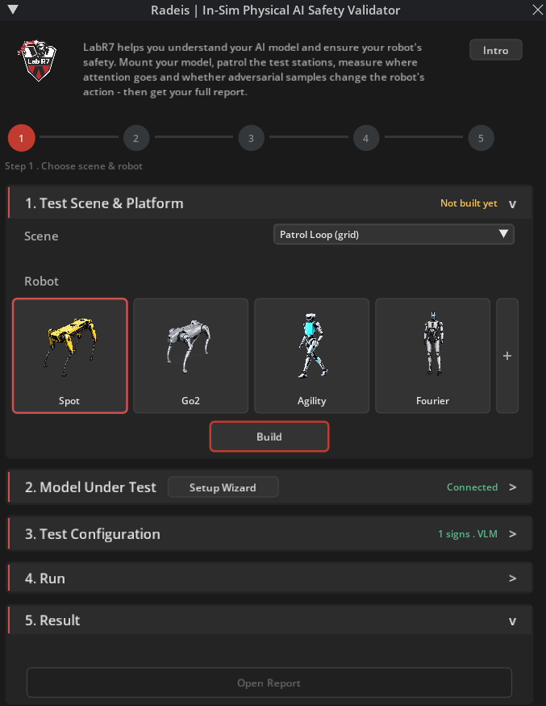

# LabR7 | Radeis | In-Sim Physical AI Safety Validator

**Understand your AI model and ensure your robot's safety through systematic red-teaming, in simulation.**
**See model's attention and know your robot's action**
`v0.2.0` - Isaac Sim 5.0 / 5.1 / 6.0

## Overview

Radeis - In-Sim Physical AI Safety Validator is a simulation tool built by LabR7 that exposes how adversarial visual artifacts exploit insufficiencies in AI models, triggering unsafe and unintended behaviors in robotic systems. Point it at your VLM or VLA policy, let the robot patrol a set of test stations, and measure exactly where the model's attention goes and whether adversarial samples change its decisions - before you ship.

---

## Introduction

VicOne, a subsidiary of the global industry leader Trend Micro, provides future-ready automotive cybersecurity solutions driven by more than 30 years of threat research and foresight.

**LabR7** - an innovation research lab of VicOne - dedicates to advancing cybersecurity for emerging technologies. Its current research focuses on AI robotics cybersecurity, pioneering new approaches to strengthen the security and resilience of intelligent systems.

A robot's most exposed interface is not a network port - it is whatever its models treat as ground truth: camera frames, sensor readings, any input mediated by a model rather than verified by a human. Adversarial patterns are simply one effective way to trigger this insufficiency: a subtly modified sign, patch, or signal - often imperceptible to a human - can systematically steer model outputs, and through them, physical behavior. No software exploit, no hardware intrusion, nothing for a conventional scan to find. The insufficiency ships inside the model itself.

Radeis turns this attack surface into a controlled, repeatable experiment. In simulation, a robot rides a moving platform through a loop of test stations: the first carries a clean baseline sign; each station after it swaps in a single adversarial sample - traffic-sign perturbations, ISO warning tampering, typography overlays, adversarial patches. At every station the extension captures the FPV frame, runs it through your model, records the chosen action, and maps the model's attention back onto the image. The report scores each attack against baseline on three axes - decision, attention, trajectory - revealing not only which attacks flipped the action, but how close the others came. That is validation in-sim, before the robot ships.

---

## Features

### Test Scene & Robot

- **Multiple built-in scenes** - Patrol Loop (grid), Warehouse; custom scenes: [contact us](https://vicone.com/contact-us/).
- **Multi-robot presets** - Boston Dynamics Spot, Unitree Go2, Agility Digit v4, Fourier GR-1; custom robot models: contact us.
- **Automatic platform** - robot mounts on an auto-height-adjusted moving platform with a forward FPV camera.

### AI Model Inference Server

- **Out-of-process inference** - the model runs as a separate FastAPI server process so it can use `transformers` eager attention and keep its VRAM off the RTX renderer.
- **Local & remote deployment** - run the inference server on the same machine or a remote GPU host; the extension auto-spawns a local server and sends a wake request to a remote launcher.
- **Setup Wizard** - one-click install of the Python environment, model weight download, and URL/model registration.
- **Live VRAM monitor** - status bar shows connection state, active model name, and real-time VRAM usage (e.g. `VRAM: 9.4 / 24.0 GB`).
- **Hot model swap** ([contact us](https://vicone.com/contact-us/))

### Test Configuration

- **Mode** - VLM (action-token mismatch) - VLA trajectory bias ([contact us](https://vicone.com/contact-us/)).
- **Test categories** - traffic signs - ISO warning signs - typography - adversarial patches.

### AI Perception View

The **AI Perception View** floating window opens automatically when a test starts and shows - in real time - what the model sees and why it acts:

- **FPV panel** - live camera feed updated at ~3 Hz while moving and at every dwell pause.
- **Inference panel** - FPV frame overlaid with per-patch attention intensity (log-percentile cold-to-hot colour ramp), attention-peak circles, attacker-region bounding box, and an action-token chip with logit margin.
- **Reasoning text** - word-by-word streaming model output below the image panels.

### Report & Metrics

Each run produces a self-contained **HTML report** with:

| Metric | Description |
|---|---|
| **Switch** | Action changed baseline -> attack |
| **Logit margin** | Confidence gap between chosen and runner-up action token |
| **ARAM** | Attention mass on the attacker region |
| **TRAM** | Attention mass ratio attack / baseline for the attacker region |
| **ADS** | Attention distraction score |
| **Severity** | Per-station severity (LOW / MED / HIGH) |
| **Switch Rate** | Fraction of stations where the action changed |
| **Status** | **ROBUST** - **PARTIAL** - **VULNERABLE** |

Reports are served locally by a built-in HTTP server and persist across sessions in `~/radeis_reports/`.

---

## More Information

To receive more impactful test patches and learn more about robotic AI model and system insufficiency, [contact us](https://vicone.com/contact-us/)!

- **VicOne** - [https://www.vicone.com](https://www.vicone.com)
- **LabR7** - [https://lab-r7.vicone.com](https://lab-r7.vicone.com)
- **GitHub** - [https://github.com/VicOne-OSS-TW/labr7-radeis-isaac-ext](https://github.com/VicOne-OSS-TW/labr7-radeis-isaac-ext)

